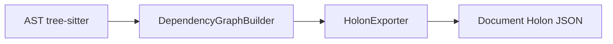
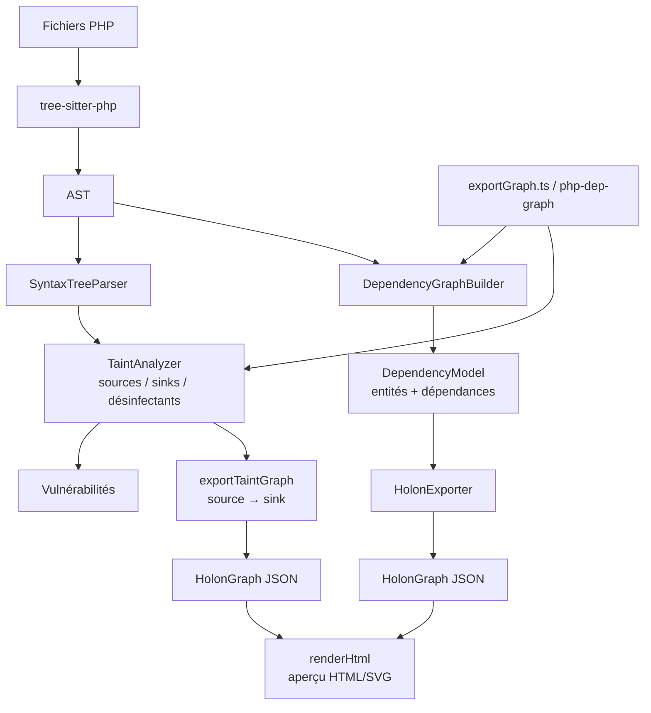

# CLAUDE.md

Guide destiné à Claude Code (et aux agents) pour travailler sur ce dépôt.

## Présentation du projet

`typescript.PHP.Sec.Scan` est un analyseur statique de code PHP écrit en
TypeScript, bâti sur l'AST de `tree-sitter`. Il fournit deux capacités :

1. **Suivi de teinte (taint tracking)** — détection de sources non désinfectées
   (superglobales `$_GET`, `$_POST`, …) et propagation à travers les affectations.
2. **Export d'un graphe de dépendances** au format *Holon Architecture Modeler*
   (`version` / `nodes` / `edges` / `metadata`).

## Conventions de documentation

Ces règles s'appliquent à toute la documentation produite dans ce dépôt
(`README.md`, `CLAUDE.md`, commentaires longs, fichiers `docs/`, messages de PR).

- **Rédige en français**, avec une orthographe et des **accents corrects**
  (é, è, à, ç, ê, î, ô, û, ë…). N'utilise jamais de français « sans accents ».
- **Privilégie les diagrammes Mermaid** aux diagrammes ASCII. Les schémas en
  art ASCII sont proscrits : ils sont illisibles, se cassent au reformatage et
  rendent mal. Utilise un bloc ` ```mermaid ` (`flowchart`, `sequenceDiagram`,
  `classDiagram`, `erDiagram`, selon le besoin).
- Garde les blocs de code annotés du bon langage (```ts`, ```bash`, ```json`…).
- Documente le *pourquoi* autant que le *comment* ; reste concis.

### Exemple : Mermaid à préférer, ASCII à éviter

À éviter (art ASCII « dégueulasse ») :

```
+--------+      +---------+      +--------+
|  AST   | ---> | Builder | ---> | Holon  |
+--------+      +---------+      +--------+
```

À préférer (Mermaid) :



## Architecture



### Fichiers clés (`src/`)

- `syntaxTreeParser.ts` — extrait des événements (affectations, appels, sinks) de l'AST.
- `taintTracker.ts` — suivi de teinte : sources → sinks, désinfection.
- `defaultRules.ts` — sinks et désinfectants par défaut.
- `dependencyGraph.ts` — construit le graphe de dépendances (symboles inter-fichiers).
- `holonExporter.ts` — mise en page déterministe + export au format Holon.
- `taintGraph.ts` — graphe de teinte (source → sink) au format Holon.
- `renderHtml.ts` — aperçu HTML/SVG autonome (dépendances ou teinte).
- `exportGraph.ts` — point d'entrée CLI (`php-dep-graph`).
- `types.ts` — interfaces TypeScript (`Vulnerability`, `Rules`, `HolonGraph`, …).

## Commandes

```bash
npm run compile        # Compile TypeScript vers out/
npm test               # Compile puis exécute les tests Mocha sur le JS émis
npm run export-graph -- ./chemin/projet-php --out graphe.json
```

## Règles de développement

- **Compile et exécute les tests** (`npm test`) avant tout commit ; les 11 tests
  doivent passer.
- **Pas de `console.log` de débogage** dans le code de bibliothèque : le CLI
  écrit du JSON pur sur `stdout`, tout parasite corromprait la sortie.
- Le dossier `out/` est un artefact de build : il est ignoré par Git, ne le
  commite jamais.
- Conserve l'intégrité référentielle du graphe : toute arête doit pointer vers
  des nœuds existants, tout `parentId` doit exister.
